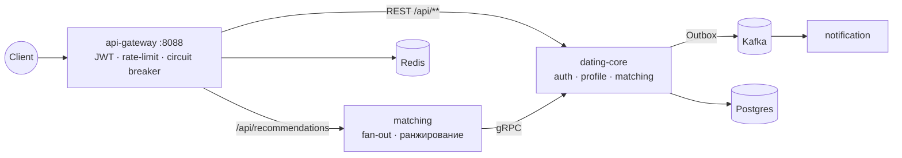

# dating-backend

Событийно-ориентированный бэкенд дейтинг-приложения на **Java 25 / Spring Boot 4**: микросервисы за API-gateway, Kafka + транзакционный Outbox, gRPC между сервисами, JWT-аутентификация с ротацией refresh-токенов. Полностью поднимается одной командой `docker compose up`.

Пет-проект с фокусом на распределённые паттерны: каждое нетривиальное решение (Outbox vs 2PC, Kafka vs RabbitMQ, виртуальные потоки vs реактив, закрытие гонки взаимного лайка) принято осознанно и задокументировано.

## Архитектура



Сквозной сценарий: регистрация → лайк A→B → лайк B→A → событие `MatchCreated` через Outbox → Kafka → notification обрабатывает идемпотентно.

## Модули

Модули независимы (без корневого pom), собираются и деплоятся по отдельности.

| Модуль | Роль | Стек |
|---|---|---|
| `dating-core` | Ядро (write-сторона): auth, profile, matching (лайки/матчи). gRPC-сервер профилей | Spring MVC, Security (JWT), Data JPA, Postgres, Liquibase, Spring Modulith (Outbox → Kafka), gRPC |
| `api-gateway` | Периметр: маршрутизация, JWT-валидация, rate-limit, отказоустойчивость | Spring Cloud Gateway (WebFlux), Redis token-bucket, Resilience4j (CircuitBreaker + TimeLimiter → 503 fallback) |
| `matching` | Read-сторона: рекомендации — параллельный fan-out за профилями и стрим-ранжирование | WebFlux, gRPC-клиент, виртуальные потоки (Java 25) |
| `notification` | Консюмер `MatchCreated` / `UserRegistered`: at-least-once + дедупликация по `eventId` | spring-kafka |

Наружу опубликован только gateway (:8088) — core, matching и gRPC-порт живут внутри docker-сети.

## Ключевые инженерные решения

- **Транзакционный Outbox на Spring Modulith** — событие пишется в таблицу `event_publication` в одной транзакции с бизнес-данными, релей публикует в Kafka. Нет ни 2PC, ни «сохранил, но не отправил». Из Modulith при этом взяты и enforced-границы модулей внутри core (`ModularityTest`).
- **Гонка взаимного лайка закрыта с двух сторон**: уникальный constraint на нормализованную пару `(user_low, user_high)` + проверка после нарушения. Оба исхода (дубль матча и потерянный матч) покрыты интеграционным тестом на гонку с `CountDownLatch`.
- **JWT с ротацией refresh-токенов и reuse-detection** — предъявление отозванного refresh-токена отзывает все активные сессии пользователя.
- **Fan-out на виртуальных потоках** — matching параллельно собирает профили кандидатов по gRPC (best-effort: недоступный профиль не валит выдачу), ранжирует Stream-конвейером. Осознанный контраст с реактивным стеком gateway — обе модели конкурентности в одном проекте.
- **Идемпотентный консюмер** — at-least-once от Kafka + дедупликация по `eventId`; события переживают повторную доставку без дублей.
- **Границы данных под будущий распил** — таблицы `likes`/`matches` без FK на `users`, связи между модулями только по id: matching-домен можно вынести в отдельный сервис без миграции данных.
- **Отказоустойчивый периметр** — Redis rate-limit (token-bucket, корректная работа за прокси через `X-Forwarded-For`), CircuitBreaker + TimeLimiter с фолбэком 503.

## События (Kafka 4, KRaft)

| Событие | Топик | Ключ |
|---|---|---|
| `UserRegistered(userId, email, displayName, eventId, occurredAt)` | `user-events` | `userId` |
| `MatchCreated(matchId, userLow, userHigh, eventId, createdAt)` | `user-matching-events` | `matchId` |

## Запуск

```bash
docker compose up          # redis, postgres, kafka, core, gateway, matching, notification
```

Вход — через gateway: `http://localhost:8088/api/...`. Сквозной сценарий — скриптом `e2e-test.ps1` / `e2e-test.bat`; коллекция запросов — в `postman/`.

Один модуль локально:

```bash
cd dating-core && ./mvnw spring-boot:run     # Windows: .\mvnw.cmd
```

## Тесты и CI

- JUnit 5 + Mockito + **Testcontainers** (Postgres, Kafka) — интеграционные тесты на реальной инфраструктуре, не на H2.
- Асинхронные проверки — awaitility (без `Thread.sleep`), гонки — `CountDownLatch`.
- Границы модулей core проверяет `ModularityTest` (Spring Modulith).
- **GitHub Actions**: матричная сборка всех модулей (JDK 25), тесты с Testcontainers, образы — в ghcr.

```bash
cd <module> && ./mvnw test   # нужен Docker (Testcontainers)
```

## Роадмап

- Подбор кандидатов по строгим фильтрам (preferences: возраст/пол/город) с разрезом retrieval/ranking — в работе.
- Реактивный чат: WebFlux + reactive MongoDB + WebSocket с JWT в handshake.
- Вынос matching-домена (лайки/матчи/preferences) из core в отдельный сервис.
- Durable-дедупликация в notification (Postgres вместо in-memory), реальный канал доставки (RabbitMQ, DLQ, ретраи).
- Общий proto-модуль вместо копий контракта; observability (Micrometer → Prometheus, OpenTelemetry).
