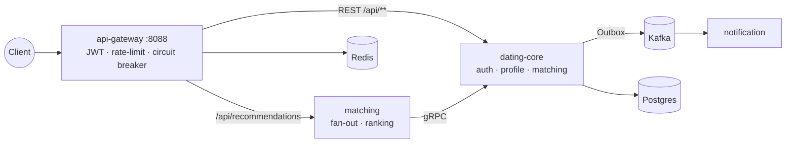

# dating-backend

*[Русская версия](README.ru.md)*

An event-driven backend for a dating application built with **Java 25 / Spring Boot 4**: microservices behind an API gateway, Kafka + Transactional Outbox, gRPC inter-service communication, and JWT authentication with refresh token rotation. The entire infrastructure spins up with a single `docker compose up` command.

This is a pet project focused on distributed system patterns: every non-trivial architectural decision (Outbox vs 2PC, Kafka vs RabbitMQ, Virtual Threads vs Reactive, handling mutual like race conditions) has been made consciously and is documented below.

## Architecture


```mermaid
flowchart LR
    Client((Client)) --> GW["api-gateway :8088\nJWT · rate-limit · circuit breaker"]
    GW -->|"REST /api/**"| CORE["dating-core\nauth · profile · matching"]
    GW -->|"/api/recommendations"| MATCH["matching\nfan-out · ranking"]
    MATCH -->|gRPC| CORE
    CORE -->|Outbox| KAFKA[(Kafka)]
    KAFKA --> NOTIF[notification]
    CORE --> PG[(Postgres)]
    GW --> REDIS[(Redis)]
```

**End-to-end scenario:** Registration → Like A→B → Like B→A → `MatchCreated` event via Outbox → Kafka → Notification service processes it idempotently.

## Modules

The modules are independent (no root `pom.xml`) and can be built and deployed separately.

| Module | Role | Stack |
|---|---|---|
| `dating-core` | Core (write-side): auth, profile, matching (likes/matches). Serves profiles via gRPC | Spring MVC, Security (JWT), Data JPA, Postgres, Liquibase, Spring Modulith (Outbox → Kafka), gRPC |
| `api-gateway` | Perimeter: routing, JWT validation, rate-limiting, fault tolerance | Spring Cloud Gateway (WebFlux), Redis token-bucket, Resilience4j (CircuitBreaker + TimeLimiter → 503 fallback) |
| `matching` | Read-side: recommendations — parallel fan-out fetching profiles and stream ranking | WebFlux, gRPC client, Virtual Threads (Java 25) |
| `notification` | Consumer for `MatchCreated` / `UserRegistered`: at-least-once + deduplication by `eventId` | spring-kafka |

Only the API gateway is exposed externally (port `8088`). The `core`, `matching`, and gRPC ports reside safely within the internal docker network.

## Key Engineering Decisions

- **Transactional Outbox via Spring Modulith** — Domain events are written to the `event_publication` table in the exact same database transaction as the business data. A relay then reliably publishes them to Kafka. This avoids 2PC and the "saved but not sent" problem. Spring Modulith is also used to enforce strict module boundaries within the core (`ModularityTest`).
- **Mutual Like Race Condition mitigated on both ends** — Implemented a unique constraint on the normalized pair `(user_low, user_high)` alongside a fallback check upon violation. Both possible race outcomes (duplicate match creation and lost match) are fully covered by an integration test using `CountDownLatch`.
- **JWT with Refresh Token Rotation and Reuse Detection** — Presenting a compromised or revoked refresh token immediately invalidates all active sessions for that user.
- **Fan-out on Virtual Threads** — The `matching` service concurrently fetches candidate profiles via gRPC (best-effort: an unavailable profile won't crash the feed) and ranks them using a Stream pipeline. This acts as a deliberate contrast to the Gateway's reactive stack, demonstrating the utilization of both concurrency models.
- **Idempotent Consumer** — Leveraging Kafka's at-least-once delivery with stateful deduplication by `eventId`. Events can survive redelivery without generating duplicate side effects.
- **Data Boundaries for Future Decoupling** — The `likes` and `matches` tables do not have strict foreign keys to the `users` table; inter-module relationships are maintained strictly by ID. The matching domain can be seamlessly extracted into a separate microservice without complex data migrations.
- **Fault-Tolerant Perimeter** — Redis-backed rate limiting (Token Bucket, correctly handling proxies via `X-Forwarded-For`), and Resilience4j CircuitBreaker + TimeLimiter configured with a 503 fallback.

## Events (Kafka 4, KRaft)

| Event | Topic | Key |
|---|---|---|
| `UserRegistered(userId, email, displayName, eventId, occurredAt)` | `user-events` | `userId` |
| `MatchCreated(matchId, userLow, userHigh, eventId, createdAt)` | `user-matching-events` | `matchId` |

## Getting Started

Spin up the entire environment (Redis, Postgres, Kafka, Core, Gateway, Matching, Notification):

```bash
docker compose up
```

Access the API through the gateway: `http://localhost:8088/api/...`

To run a single module locally:

```bash
cd dating-core && ./mvnw spring-boot:run     # On Windows: .\mvnw.cmd spring-boot:run
```

## Testing & CI/CD

- **Testcontainers** (Postgres, Kafka) + JUnit 5 + Mockito — Integration tests run on real infrastructure, completely avoiding in-memory H2 discrepancies.
- Asynchronous assertions are handled with **Awaitility** (no hardcoded `Thread.sleep`), and concurrent race conditions are tested using `CountDownLatch`.
- Internal module boundaries in the core are continuously validated by `ModularityTest` (Spring Modulith).
- **GitHub Actions**: Matrix builds for all modules (JDK 25), full integration testing via Testcontainers, and automated Docker image pushes to GitHub Container Registry (ghcr).

## Roadmap

- Strict candidate filtering (preferences: age/gender/city) with clear retrieval and ranking phases — *in progress*.
- Reactive Chat: WebFlux + Reactive MongoDB + WebSockets (JWT handled during handshake).
- Extraction of the matching domain (likes/matches/preferences) from `core` into an independent microservice.
- Durable deduplication in the `notification` service (Postgres instead of in-memory) and a robust delivery channel (RabbitMQ with DLQ and retries).
- Shared `proto` module to eliminate contract duplication; observability stack implementation (Micrometer → Prometheus, OpenTelemetry).
